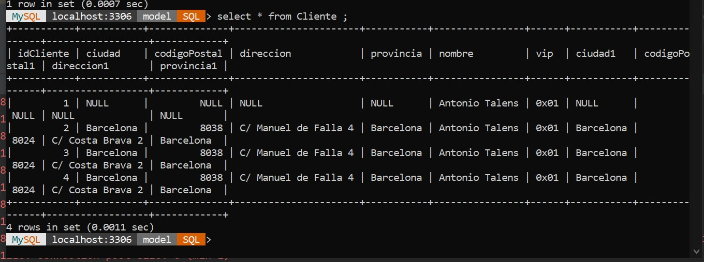

# solución
primer cosa es conectar la aplicacion con la base de datos
- he creado una base de datos nueva con el nombre "Model"
- he puesto el usuario y la contraseña ern el fichero hibernate.cfg.xml

he usado el @attributeoverride para  sobrescribir la configuración de mapeo de atributos específicos  de la entidad Direccion y asi me permite personalizar la forma en que se almacenan los datos de la entidad en la base de datos.

# Mysql Shell Console

